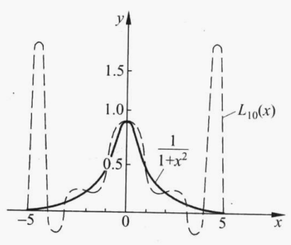

对任意的插值节点，当 $ n \rightarrow \infty $ 时， $ L_n(x) $ 不一定收敛于 $ f(x) $ 。龙格（Runge）给出了一个等距节点插值多项式 $ L_n(x) $ 不收敛于 $ f(x) $ 的例子。

取 $ f(x) = \frac {1} {1 + x^2} $ ，插值区间为 $ [-5, 5] $ ，插值节点为 $ x_k = -5 + \frac {10k} {n} (k = 0, 1, ... , n) $ 。

令 $ x_{n - 0.5} = 0.5(x_{n-1} + x_n) = 5 - \frac {5} {n} $ ，当 $ n = 2, 4, ... , 20 $ 时， $ x_{n - 0.5} $ 处的插值余项会随着 $ n $ 增加而增加，当 $ n \rightarrow \infty $ 时， $ L_n(x) $ 在 $ [-5, 5] $ 上不收敛。



龙格证明了，存在一个常数 $ c \approx 3.63 $ ，使得当 $ \vert x \vert \leqslant c $ 时， $ \lim \limits_{n \rightarrow \infty} L_n(x) = f(x) $ ，而当 $ \vert x \vert > c $ 时， $ L_n(x) $ 发散。

高次插值多项式的近似效果通常不好，称之为高次插值的病态性质。

* * *

定义：设已知节点 $ a = x_0 < x_1 < ... < x_n = b $ 上的函数值 $ f_0, f_1, ... , f_n $ ，记 $ h_k = x_{k+1} - x_k, h = \underset {k} {\max} h_k $ ，求一折线函数 $ I_h(x) $ 满足：

（1） $ I_h(x) \in C[a, b] $ 

（2） $ I_h(x_k) = f_k (k = 0, 1, ... , n) $ 

（3） $ I_h(x) $ 在每个小区间 $ [x_k, x_{k+1}] $ 上是线性函数

则称 $ I_h(x) $ 为**分段线性插值函数**。

* * *

由定义可知 $ I_h(x) $ 在每个小区间 $ [x_k, x_{k+1}] $ 上可表示为

$$
I_h(x) = \frac {x - x_{k+1}} {x_k - x_{k+1}} f_k + \frac {x - x_k} {x_{k+1} - x_k} f_{k+1}, x_k \leqslant x \leqslant x_{k+1}, k = 0, 1, ... , n-1
$$

分段线性插值的误差估计可利用插值余项得到

$$
\underset {x_k \leqslant x \leqslant x_{k+1}} {\max} \vert f(x) - I_h(x) \vert \leqslant \frac {M_2} {2} \underset {x_k \leqslant x \leqslant x_{k+1}} {\max} \vert (x - x_k) (x - x_{k+1}) \vert
$$

其中 $ M_2 = \underset {a \leqslant x \leqslant b} {\max} \vert f''(x) \vert $ 。

进而有

$$
\underset {a \leqslant x \leqslant b} {\max} \vert f(x) - I_h(x) \vert \leqslant \frac {M_2} {8} h^2
$$

由此还可得

$$
\lim \limits_{h \rightarrow 0} I_h(x) = f(x)
$$

在 $ [a, b] $ 上一致成立，故 $ I_h(x) $ 在 $ [a, b] $ 上一致收敛到 $ f(x) $ 。

* * *

分段线性插值的C++实现
```C++
#include <vector>
using std::vector;

class Piecewise_linear_interpolation
{
public:
	Piecewise_linear_interpolation(const vector<float>& x, const vector<float>& y)
	{
		x_ = x;
		y_ = y;
		n_ = int(x.size()) - 1;
	}

	virtual ~Piecewise_linear_interpolation()
	{

	}

	virtual void Set_interpolation_nodes(const vector<float>& x, const vector<float>& y)
	{
		x_ = x;
		y_ = y;
		n_ = int(x.size()) - 1;
	}

	virtual float Eval(float x)
	{
		if (x_.at(0) > x || x_.at(n_) < x)
		{
			return 0.f;
		}

		for (size_t k = 0; k < n_; k++)
		{
			if (x_[k + 1] >= x)
			{
				return (x - x_[k + 1]) / (x_[k] - x_[k + 1]) * y_[k] + (x - x_[k]) / (x_[k + 1] - x_[k]) * y_[k + 1];
			}
		}
	}

private:
	int n_;
	vector<float> x_;
	vector<float> y_;
};
```

* * *

若在节点 $ x_k (k = 0, 1, ... , n) $ 上还给出导数值 $ f'_k $ ，则可构造一个导数连续的分段插值函数，它满足条件：

（1） $ I_h(x) \in C^1[a, b] $ 

（2） $ I_h(x_k) = f_k, I'_h(x_k) = f'_k (k = 0, 1, ... , n) $ 

（3） $ I_h(x) $ 在每个小区间 $ [x_k, x_{k+1}] $ 上是三次多项式

则称 $ I_h(x) $ 为**分段三次埃尔米特插值函数**。

* * *

根据两点三次埃尔米特插值可知， $ I_h(x) $ 在区间 $ [x_k, x_{k+1}] $ 上的表达式为

$$
I_h(x) = \frac {(2x + x_{k+1} - 3x_k) (x - x_{k+1})^2} {(x_{k+1} - x_k)^3} f_k + \frac {(2x + x_k - 3x_{k+1}) (x - x_k)^2} {(x_k - x_{k+1})^3} f_{k+1} + \frac {(x - x_k) (x - x_{k+1})^2} {(x_k - x_{k+1})^2} f'_k + \frac {(x - x_{k+1}) (x - x_k)^2} {(x_{k+1} - x_k)^2} f'_{k+1}, k = 0, 1, ... , n-1
$$

* * *

定理：设 $ f \in C^4[a, b] $ ， $ I_h(x) $ 为 $ f(x) $ 在节点 $ a = x_0 < x_1 < ... < x_n = b $ 上的分段三次埃尔米特插值多项式，则有

$$
\underset {a \leqslant x \leqslant b} {\max} \vert f(x) - I_h(x) \vert \leqslant \frac {h^4} {384} \underset {a \leqslant x \leqslant b} {\max} \vert f^{(4)}(x) \vert
$$

其中 $ h = \underset {0 \leqslant k \leqslant n-1} {\max} (x_{k+1} - x_k) $ 。

证明：利用三次埃尔米特插值的余项可得误差估计

$$
\underset {x_k \leqslant x \leqslant x_{k+1}} {\max} \vert f(x) - I_h(x) \vert \leqslant \frac {(x_{k+1} - x_k)^4} {384} \underset {x_k \leqslant x \leqslant x_{k+1}} {\max} \vert f^{(4)}(x) \vert
$$

易知结论成立。

* * *

分段三次埃尔米特插值函数优点：由上述定理可知其对比分段线性插值误差通常更小；缺点：要求给出插值点的导数值，要给的信息太多，光滑度不高（只有一阶导数连续）。

* * *

分段三次埃尔米特插值的C++实现
```C++
#include <vector>
using std::vector;

class Two_points_Hermimte_polynomial;

class Piecewise_cubic_Hermite_interpolation
{
public:
	Piecewise_cubic_Hermite_interpolation()
	{
		n_ = -1;
	}

	Piecewise_cubic_Hermite_interpolation(const vector<float>& x, const vector<float>& y, const vector<float>& dy)
	{
		x_ = x;
		y_ = y;
		dy_ = dy;
		n_ = int(x.size()) - 1;
		H_3s_.resize(n_);
		for (size_t k = 0; k < n_; k++)
		{
			H_3s_[k].Set_interpolation_nodes({ x_[k], x_[k + 1] }, { y_[k], y_[k + 1] }, { dy_[k], dy_[k + 1] });
		}
	}

	virtual ~Piecewise_cubic_Hermite_interpolation()
	{

	}

	virtual void Set_interpolation_nodes(const vector<float>& x, const vector<float>& y, const vector<float>& dy)
	{
		x_ = x;
		y_ = y;
		dy_ = dy;
		n_ = int(x.size()) - 1;
		H_3s_.resize(n_);
		for (size_t k = 0; k < n_; k++)
		{
			H_3s_[k].Set_interpolation_nodes({ x_[k], x_[k + 1] }, { y_[k], y_[k + 1] }, { dy_[k], dy_[k + 1] });
		}
	}

	virtual float Eval(float x)
	{
		if (x_.at(0) > x || x_.at(n_) < x)
		{
			return 0.f;
		}

		for (size_t k = 0; k < n_; k++)
		{
			if (x_[k + 1] >= x)
			{
				return H_3s_[k].Eval(x);
			}
		}
	}

private:
	int n_;
	vector<float> x_;
	vector<float> y_;
	vector<float> dy_;
	vector<Two_points_Hermimte_polynomial> H_3s_;
};
```

* * *

定义：若函数 $ S(x) \in C^2[a, b] $ ，且在每个小区间 $ [x_j, x_{j+1}] $ 上是三次多项式，其中 $ a = x_0 < x_1 < ... < x_n = b $ 是给定节点，则称 $ S(x) $ 是节点 $ x_0, x_1, ... , x_n $ 上的**三次样条函数**。若在节点 $ x_j $ 上给定函数值 $ y_j = f(x_j) (j = 0, 1, ... , n) $ ，并成立

$$
S(x_j) = y_j, j = 0, 1, ... , n
$$

则称 $ S(x) $ 为**三次样条插值函数**。

* * *

从定义知要求出 $ S(x) $ ，在每个小区间 $ [x_j, x_{j+1}] $ 上要确定 $ 4 $ 个待定系数，而共有 $ n $ 个小区间，故应确定 $ 4n $ 个参数。根据 $ S(x) $ 在 $ [a, b] $ 上二阶导数连续，在节点 $ x_j (j = 1, 2, ... , n-1) $ 处应满足连续性条件

$$
S(x_j - 0) = S(x_j + 0) \\
S'(x_j - 0) = S'(x_j + 0) \\
S''(x_j - 0) = S''(x_j + 0)
$$

这里共有 $ 3n-3 $ 个条件，再加上 $ S(x) $ 满足插值条件 $ S(x_j) = y_j $ ，共有 $ 4n-2 $ 个条件，因此还需要加上 $ 2 $ 个条件才能确定 $ S(x) $ 。

通常可在区间 $ [a, b] $ 的端点 $ a = x_0, b = x_n $ 上各加一个条件（称为**边界条件**），也可根据实际问题的要求给定。常见的有一下3种：

（1）已知两端的一阶导数值，即

$$
S'(x_0) = f'_0 \\
S'(x_n) = f'_n
$$

（2）两端的二阶导数已知，即

$$
S''(x_0) = f''_0 \\
S''(x_n) = f''_n
$$

其特殊情况为

$$
S''(x_0) = S''(x_n) = 0
$$

称为**自然边界条件**。

（3）当 $ f(x) $ 是以 $ b - a $ 为周期的周期函数时，则要求 $ S(x) $ 也是周期函数。这时边界条件应该满足

$$
y_0 = S(x_0 + 0) = S(x_n - 0) = y_n \\
S'(x_0 + 0) = S'(x_n - 0) \\
S''(x_0 + 0) = S''(x_n - 0)
$$

这样确定的样条函数 $ S(x) $ 称为**周期样条函数**。

* * *

构造三次样条插值函数的一种方法：假定 $ S''(x_j) = M_j, (j = 0, 1, ... , n) $ ，由于 $ S(x) $ 在区间 $ [x_j, x_{j+1}] $ 上是三次多项式，故 $ S''(x) $ 在 $ [x_j, x_{j+1}] $ 上是线性函数，可表示为

$$
S''(x) = \frac {x_{j+1} - x} {h_j} M_j + \frac {x - x_j} {h_j} M_{j+1} \quad h_j = x_{j+1} - x_j
$$

对 $ S''(x) $ 积分两次得

$$
S(x) = \frac {(x_{j+1} - x)^3} {6h_j} M_j + \frac {(x - x_j)^3} {6h_j} M_{j+1} + Cx + D
$$

利用 $ S(x_j) = y_j $ 及 $ S(x_{j+1}) = y_{j+1} $ ，可定出积分常数

$$
Cx + D = (y_j - \frac {h_j^2} {6} M_j) \frac {x_{j+1} - x} {h_j} + (y_{j+1} - \frac {h_j^2} {6} M_{j+1}) \frac {x - x_j} {h_j}
$$

于是得三次样条表达式

$$
S(x) = \frac {(x_{j+1} - x)^3} {6h_j} M_j + \frac {(x - x_j)^3} {6h_j} M_{j+1} + (y_j - \frac {h_j^2} {6} M_j) \frac {x_{j+1} - x} {h_j} + (y_{j+1} - \frac {h_j^2} {6} M_{j+1}) \frac {x - x_j} {h_j}
$$

这里 $ M_j (j = 0, 1, ... , n) $ 是未知的。为了确定 $ M_j $ ，对 $ S(x) $ 求导得

$$
S'(x) = -\frac {(x_{j+1} - x)^2} {2h_j} M_j + \frac {(x - x_j)^2} {2h_j} M_{j+1} + \frac {y_{j+1} - y_j} {h_j} - \frac {M_{j+1} - M_j} {6} h_j
$$

由此求得

$$
S'(x_j + 0) = \frac {y_{j+1} - y_j} {h_j} - \frac {M_j} {3} h_j - \frac {M_{j+1}} {6} h_j
$$

类似地可求出 $ S(x) $ 在区间 $ [x_{j-1}, x_j] $ 上的表达式，进而得

$$
S'(x_j - 0) = \frac {y_j - y_{j-1}} {h_{j-1}} + \frac {M_j} {3} h_{j-1} + \frac {M_{j-1}} {6} h_{j-1}
$$

利用 $ S'(x_j + 0) = S'(x_j - 0) $ 可得

$$
\mu_j M_{j-1} + 2 M_j + \lambda_j M_{j+1} = d_j, j = 1, 2, ... , n-1
$$

其中

$$
\mu_j = \frac {h_{j-1}} {h_{j-1} + h_j} \quad \lambda_j = \frac {h_j} {h_{j-1} + h_j} \quad d_j = 6f[x_{j-1}, x_j, x_{j+1}] \quad j = 1, 2, ... , n-1
$$

对第一种边界条件，可导出两个方程

$$
2 M_0 + M_1 = \frac {6 (f[x_0, x_1] - f'_0)} {h_0} \\
M_{n-1} + 2 M_n = \frac {6 (f'_n - f[x_{n-1}, x_n])} {h_{n-1}} \\
$$

如果令

$$
\lambda_0 = 1 \quad d_0 = \frac {6 (f[x_0, x_1] - f'_0)} {h_0} \\
\mu_n = 1 \quad d_n = \frac {6 (f'_n - f[x_{n-1}, x_n])} {h_{n-1}}
$$

则有矩阵形式表示的关于 $ M_j (j = 0, 1, ... , n) $ 的线性方程组

$$
\begin{bmatrix}
    {2}     & {\lambda_0}   &               &           &                   \\
    {\mu_1} & {2}           & {\lambda_1}   &           &                   \\
            & {\ddots}      & {\ddots}      & {\ddots}  &                   \\
            &               & {\mu_{n-1}}   & {2}       & {\lambda_{n-1}}   \\
            &               &               & {\mu_n}   & {2}       
\end{bmatrix}
\begin{bmatrix}
    M_0         \\
    M_1         \\
    {\vdots}    \\
    M_{n-1}     \\
    M_n         
\end{bmatrix}
=
\begin{bmatrix}
    d_0         \\
    d_1         \\
    {\vdots}    \\
    d_{n-1}     \\
    d_n         
\end{bmatrix}
$$

对于第二种边界条件，直接有

$$
M_0 = f''_0 \quad M_n = f''_n
$$

如果令

$$
\lambda_0 = 0 \quad d_0 = 2 f''_0 \\
\mu_n = 0 \quad d_n = 2 f''_n
$$

则同样有如上的矩阵形式的线性方程组。

对于第三种边界条件，有

$$
M_0 = M_n \quad \lambda_n M_1 + \mu_n M_{n-1} + 2 M_n = d_n
$$

其中

$$
\mu_n = \frac {h_{n-1}} {h_{n-1} + h_0} \quad \lambda_n = \frac {h_0} {h_{n-1} + h_0} \quad d_n = 6 \frac {f[x_0, x_1] - f[x_{n-1}, x_n]} {h_{n-1} + h_0}
$$

从而有矩阵形式表示的关于 $ M_j (j = 0, 1, ... , n) $ 的线性方程组

$$
\begin{bmatrix}
    {2}         & {\lambda_1}   &               &           & {\mu_1}           \\
    {\mu_2}     & {2}           & {\lambda_2}   &           &                   \\
                & {\ddots}      & {\ddots}      & {\ddots}  &                   \\
                &               & {\mu_{n-1}}   & {2}       & {\lambda_{n-1}}   \\
    {\lambda_n} &               &               & {\mu_n}   & {2}       
\end{bmatrix}
\begin{bmatrix}
    M_1         \\
    M_2         \\
    {\vdots}    \\
    M_{n-1}     \\
    M_n         
\end{bmatrix}
=
\begin{bmatrix}
    d_1         \\
    d_2         \\
    {\vdots}    \\
    d_{n-1}     \\
    d_n         
\end{bmatrix}
$$

$ S''(x) $ 在力学上解释为细梁在 $ x $ 截面处的弯矩，称为 $ S(x) $ 的矩，上文的关于 $ M_j (j = 0, 1, ... , n) $ 的三对角线性方程组称为三弯矩方程。方程组的系数矩阵中元素 $ \mu_j, \lambda_j $ 已完全确定，并且满足 $ \mu_j \geqslant 0, \lambda_j \geqslant 0, \mu_j + \lambda_j \lt 2 $ ，因此系数矩阵为严格对角占优矩阵，从而 $ M_j $ 有唯一解。（求解方法可采用追赶法）

* * *

三次样条插值的C++实现
```C++
#include <vector>
using std::vector;
using std::copy;

class LU_triple_diagonal_matrix_1;

class LU_triple_diagonal_matrix_2;

class Cubic_spline_interpolation_1
{
public:
	Cubic_spline_interpolation_1(const vector<float>& x, const vector<float>& y)
	{
		Set_interpolation_nodes(x, y);
	}

	virtual ~Cubic_spline_interpolation_1()
	{

	}

	virtual void Set_interpolation_nodes(const vector<float>& x, const vector<float>& y)
	{
		x_ = x;
		y_ = y;
		n_ = int(x.size()) - 1;
		h_.resize(n_);
		M_.resize(n_ + 1);
		mu_.resize(n_ + 1);
		lambda_.resize(n_ + 1);
		d_.resize(n_ + 1);
		for (size_t j = 0; j < n_; j++)
		{
			h_[j] = x_[j + 1] - x_[j];
		}
		for (size_t j = 1; j < n_; j++)
		{
			float temp = h_[j - 1] + h_[j];
			mu_[j] = h_[j - 1] / temp;
			lambda_[j] = h_[j] / temp;
			d_[j] = 6.f * ((y_[j + 1] - y_[j]) / h_[j] - (y_[j] - y_[j - 1]) / h_[j - 1]) / temp;
		}
	}

	virtual void Set_first_boundary_conditions(float dy0, float dyn)
	{
		lambda_[0] = 1.f;
		d_[0] = 6.f * ((y_[1] - y_[0]) / h_[0] - dy0) / h_[0];
		mu_[n_] = 1.f;
		d_[n_] = 6.f * (dyn - (y_[n_] - y_[n_ - 1]) / h_[n_ - 1]) / h_[n_ - 1];
		LU_triple_diagonal_matrix_1 solver(mu_, vector<float>(n_ + 1, 2.f), lambda_);
		solver.Solve(d_, M_);
	}

	virtual void Set_second_boundary_conditions(float ddy0 = 0.f, float ddyn = 0.f)
	{
		lambda_[0] = 0.f;
		d_[0] = 2.f * ddy0;
		mu_[n_] = 0.f;
		d_[n_] = 2.f * ddyn;
		LU_triple_diagonal_matrix_1 solver(mu_, vector<float>(n_ + 1, 2.f), lambda_);
		solver.Solve(d_, M_);
	}

	virtual void Set_periodic_boundary_conditions()
	{
		float temp = h_[n_ - 1] + h_[0];
		mu_[n_] = h_[n_ - 1] / temp;
		lambda_[n_] = h_[0] / temp;
		d_[n_] = 6.f * ((y_[1] - y_[0]) / h_[0] - (y_[n_] - y_[n_ - 1]) / h_[n_ - 1]) / temp;

		vector<float> temp_mu;
		temp_mu.assign(++mu_.begin(), mu_.end());
		vector<float> temp_lambda;
		temp_lambda.assign(++lambda_.begin(), lambda_.end());
		LU_triple_diagonal_matrix_2 solver(temp_mu, vector<float>(n_, 2.f), temp_lambda);
		vector<float> temp_d;
		temp_d.assign(++d_.begin(), d_.end());
		vector<float> temp_M(n_);
		solver.Solve(temp_d, temp_M);
		copy(temp_M.begin(), temp_M.end(), ++M_.begin());
		M_[0] = M_[n_];
	}

	virtual float Eval(float x)
	{
		if (x_.at(0) > x || x_.at(n_) < x)
		{
			return 0.f;
		}

		for (size_t j = 0; j < n_; j++)
		{
			if (x_[j + 1] >= x)
			{
				float r = x_[j + 1] - x;
				float l = x - x_[j];
				return ((r * r * r * M_[j] + l * l * l * M_[j + 1]) / 6.f + ((y_[j] - h_[j] * h_[j] * M_[j] / 6.f) * r + (y_[j + 1] - h_[j] * h_[j] * M_[j + 1] / 6.f) * l)) / h_[j];
			}
		}
	}

private:
	int n_;
	vector<float> x_;
	vector<float> y_;
	vector<float> h_;
	vector<float> M_;
	vector<float> mu_;
	vector<float> lambda_;
	vector<float> d_;
};
```

* * *

构造三次样条插值函数的另一种方法：假定 $ S'(x_j) = m_j, (j = 0, 1, ... , n) $ ，根据两点三次埃尔米特插值， $ S(x) $ 在 $ [x_j, x_{j+1}] $ 上可表示为

$$
S(x) = \alpha_{j, j+1}(x) y_j + \alpha_{j+1, j}(x) y_{j+1} + \beta_{j, j+1}(x) m_j + \beta_{j+1, j}(x) m_{j+1}
$$

其中

$$
\alpha_{j, j+1}(x) = \frac {(2x + x_{j+1} - 3x_j) (x - x_{j+1})^2} {h_j^3} \\
\alpha_{j+1, j}(x) = -\frac {(2x + x_j - 3x_{j+1}) (x - x_j)^2} {h_j^3} \\
\beta_{j, j+1}(x) = \frac {(x - x_j) (x - x_{j+1})^2} {h_j^2} \\
\beta_{j+1, j}(x) = \frac {(x - x_{j+1}) (x - x_j)^2} {h_j^2} \\
h_j = x_{j+1} - x_j
$$

这里 $ m_j (j = 0, 1, ... , n) $ 是未知的。为了确定 $ m_j $ ，对 $ S(x) $ 求二阶导得

$$
S''(x) = \alpha''_{j, j+1}(x) y_j + \alpha''_{j+1, j}(x) y_{j+1} + \beta''_{j, j+1}(x) m_j + \beta''_{j+1, j}(x) m_{j+1}
$$

其中

$$\alpha''_{j, j+1}(x) = \frac {6 [(x - x_j) - (x_{j+1} - x)]} {h_j^3} \\
\alpha''_{j+1, j}(x) = -\frac {6 [(x - x_j) - (x_{j+1} - x)]} {h_j^3} \\
\beta''_{j, j+1}(x) = \frac {2 (x - x_j) - 4 (x_{j+1} - x)} {h_j^2} \\
\beta''_{j+1, j}(x) = \frac {4 (x - x_j) - 2 (x_{j+1} - x)} {h_j^2}
$$

由此求得

$$
S''(x_j + 0) = -\frac {6 y_j} {h_j^2} + \frac {6 y_{j+1}} {h_j^2} - \frac {4 m_j} {h_j} - \frac {2 m_{j+1}} {h_j}
$$

类似地可求出 $ S(x) $ 在区间 $ [x_{j-1}, x_j] $ 上的表达式，进而得

$$
S''(x_j - 0) = \frac {6 y_{j-1}} {h_{j-1}^2} - \frac {6 y_j} {h_{j-1}^2} + \frac {2 m_{j-1}} {h_{j-1}} + \frac {4 m_j} {h_{j-1}}
$$

利用 $ S''(x_j + 0) = S''(x_j - 0) $ 可得

$$
\mu_j m_{j-1} + 2 m_j + \lambda_j m_{j+1} = d_j, j = 1, 2, ... , n-1
$$

其中

$$
\mu_j = \frac {h_j} {h_{j-1} + h_j} \quad \lambda_j = \frac {h_{j-1}} {h_{j-1} + h_j} \quad d_j = 3 [\lambda_j f[x_j, x_{j+1}] + \mu_j f[x_{j-1}, x_j]] \quad j = 1, 2, ... , n-1
$$

对于第一种边界条件，直接有

$$
m_0 = f'_0 \quad m_n = f'_n
$$

如果令

$$
\lambda_0 = 0 \quad d_0 = 2 f'_0 \\
\mu_n = 0 \quad d_n = 2 f'_n
$$

则有矩阵形式表示的关于 $ m_j (j = 0, 1, ... , n) $ 的线性方程组

$$
\begin{bmatrix}
    {2}     & {\lambda_0}   &               &           &                   \\
    {\mu_1} & {2}           & {\lambda_1}   &           &                   \\
            & {\ddots}      & {\ddots}      & {\ddots}  &                   \\
            &               & {\mu_{n-1}}   & {2}       & {\lambda_{n-1}}   \\
            &               &               & {\mu_n}   & {2}       
\end{bmatrix}
\begin{bmatrix}
    m_0         \\
    m_1         \\
    {\vdots}    \\
    m_{n-1}     \\
    m_n         
\end{bmatrix}
=
\begin{bmatrix}
    d_0         \\
    d_1         \\
    {\vdots}    \\
    d_{n-1}     \\
    d_n         
\end{bmatrix}
$$

对第二种边界条件，可导出两个方程

$$
2 m_0 + m_1 = 3[f[x_0, x_1] - \frac {h_0} {6} f''_0] \\
m_{n-1} + 2 m_n = 3[\frac {h_{n-1}} {6} f''_n + f[x_{n-1}, x_n]]
$$

如果令

$$
\lambda_0 = 1 \quad d_0 = 3[f[x_0, x_1] - \frac {h_0} {6} f''_0] \\
\mu_n = 1 \quad d_n = 3[\frac {h_{n-1}} {6} f''_n + f[x_{n-1}, x_n]]
$$

则同样有如上的矩阵形式的线性方程组。

对于第三种边界条件，有

$$
m_0 = m_n \quad \lambda_n m_1 + \mu_n m_{n-1} + 2 m_n = d_n
$$

其中

$$
\mu_n = \frac {h_0} {h_{n-1} + h_0} \quad \lambda_n = \frac {h_{n-1}} {h_{n-1} + h_0} \quad d_n = 3 [\lambda_n f[x_0, x_1] + \mu_n f[x_{n-1}, x_n]]
$$

从而有矩阵形式表示的关于 $ m_j (j = 0, 1, ... , n) $ 的线性方程组

$$
\begin{bmatrix}
    {2}         & {\lambda_1}   &               &           & {\mu_1}           \\
    {\mu_2}     & {2}           & {\lambda_2}   &           &                   \\
                & {\ddots}      & {\ddots}      & {\ddots}  &                   \\
                &               & {\mu_{n-1}}   & {2}       & {\lambda_{n-1}}   \\
    {\lambda_n} &               &               & {\mu_n}   & {2}       
\end{bmatrix}
\begin{bmatrix}
    m_1         \\
    m_2         \\
    {\vdots}    \\
    m_{n-1}     \\
    m_n         
\end{bmatrix}
=
\begin{bmatrix}
    d_1         \\
    d_2         \\
    {\vdots}    \\
    d_{n-1}     \\
    d_n         
\end{bmatrix}
$$

易知系数矩阵为严格对角占优矩阵，从而 $ m_j $ 有唯一解。

* * *

三次样条插值的C++实现
```C++
#include <vector>
using std::vector;
using std::copy;

class Two_points_Hermimte_polynomial;

class Piecewise_cubic_Hermite_interpolation;

class LU_triple_diagonal_matrix_1;

class LU_triple_diagonal_matrix_2;

class Cubic_spline_interpolation_2
{
public:
	Cubic_spline_interpolation_2(const vector<float>& x, const vector<float>& y)
	{
		Set_interpolation_nodes(x, y);
	}

	virtual ~Cubic_spline_interpolation_2()
	{

	}

	virtual void Set_interpolation_nodes(const vector<float>& x, const vector<float>& y)
	{
		x_ = x;
		y_ = y;
		n_ = int(x.size()) - 1;
		h_.resize(n_);
		m_.resize(n_ + 1);
		mu_.resize(n_ + 1);
		lambda_.resize(n_ + 1);
		d_.resize(n_ + 1);
		for (size_t j = 0; j < n_; j++)
		{
			h_[j] = x_[j + 1] - x_[j];
		}
		for (size_t j = 1; j < n_; j++)
		{
			float temp = h_[j - 1] + h_[j];
			mu_[j] = h_[j] / temp;
			lambda_[j] = h_[j - 1] / temp;
			d_[j] = 3.f * (lambda_[j] * (y_[j + 1] - y_[j]) / h_[j] + mu_[j] * (y_[j] - y_[j - 1]) / h_[j - 1]);
		}
	}

	virtual void Set_first_boundary_conditions(float dy0, float dyn)
	{
		lambda_[0] = 0.f;
		d_[0] = 2.f * dy0;
		mu_[n_] = 0.f;
		d_[n_] = 2.f * dyn;
		LU_triple_diagonal_matrix_1 solver(mu_, vector<float>(n_ + 1, 2.f), lambda_);
		solver.Solve(d_, m_);
		piecewise_H_3_.Set_interpolation_nodes(x_, y_, m_);
	}

	virtual void Set_second_boundary_conditions(float ddy0 = 0.f, float ddyn = 0.f)
	{
		lambda_[0] = 1.f;
		d_[0] = 3.f * ((y_[1] - y_[0]) / h_[0] - h_[0] * ddy0 / 6.f);
		mu_[n_] = 1.f;
		d_[n_] = 3.f * (h_[n_ - 1] * ddyn / 6.f - (y_[n_] - y_[n_ - 1]) / h_[n_ - 1]);
		LU_triple_diagonal_matrix_1 solver(mu_, vector<float>(n_ + 1, 2.f), lambda_);
		solver.Solve(d_, m_);
		piecewise_H_3_.Set_interpolation_nodes(x_, y_, m_);
	}

	virtual void Set_periodic_boundary_conditions()
	{
		float temp = h_[n_ - 1] + h_[0];
		mu_[n_] = h_[0] / temp;
		lambda_[n_] = h_[n_ - 1] / temp;
		d_[n_] = 3.f * (lambda_[n_] * (y_[1] - y_[0]) / h_[0] + mu_[n_] * (y_[n_] - y_[n_ - 1]) / h_[n_ - 1]);

		vector<float> temp_mu;
		temp_mu.assign(++mu_.begin(), mu_.end());
		vector<float> temp_lambda;
		temp_lambda.assign(++lambda_.begin(), lambda_.end());
		LU_triple_diagonal_matrix_2 solver(temp_mu, vector<float>(n_, 2.f), temp_lambda);
		vector<float> temp_d;
		temp_d.assign(++d_.begin(), d_.end());
		vector<float> temp_m(n_);
		solver.Solve(temp_d, temp_m);
		copy(temp_m.begin(), temp_m.end(), ++m_.begin());
		m_[0] = m_[n_];
		piecewise_H_3_.Set_interpolation_nodes(x_, y_, m_);
	}

	virtual float Eval(float x)
	{
		return piecewise_H_3_.Eval(x);
	}

private:
	int n_;
	vector<float> x_;
	vector<float> y_;
	vector<float> h_;
	vector<float> m_;
	vector<float> mu_;
	vector<float> lambda_;
	vector<float> d_;
	Piecewise_cubic_Hermite_interpolation piecewise_H_3_;
};
```

* * *

关于三次样条插值的收敛性和误差估计有如下定理（没有证明，作者说太复杂）

定理：设 $ f(x) \in C^4[a, b] $ ， $ S(x) $ 为满足第一种或第二种边界条件的三次样条函数，令 $ h = \underset {0 \leqslant j \leqslant n-1} {\max} h_j (h_j = x_{j+1} - x_j) $ 则有估计式

$$
\underset {a \leqslant x \leqslant b} {\max} \vert f^{(k)}(x) - S^{(k)}(x) \vert \leqslant C_k \underset {a \leqslant x \leqslant b} {\max} \vert f^{(4)}(x) \vert h^{4-k}, k = 0, 1, 2
$$

其中 $ C_0 = \frac {5} {384}, C_1 = \frac {1} {24}, C_2 = \frac {3} {8} $ 。

* * *

根据上述定理可知，当 $ h \rightarrow 0 $ 时， $ S(x), S'(x), S''(x) $ 均分别一致收敛于 $ f(x), f'(x), f''(x) $ 。

* * *

附：追赶法解三对角系数矩阵线性方程组的C++实现
```C++
#include <vector>
using std::vector;

class LU_triple_diagonal_matrix_1
{
public:
	LU_triple_diagonal_matrix_1(const vector<float>& a, const vector<float>& b, const vector<float>& c)
	{
		Set_triple_diagonal_matrix(a, b, c);
	}

	virtual ~LU_triple_diagonal_matrix_1()
	{

	}

	virtual void Set_triple_diagonal_matrix(const vector<float>& a, const vector<float>& b, const vector<float>& c)
	{
		a_ = a;
		b_ = b;
		c_ = c;
		n_ = int(b.size());
		beta_.resize(n_ - 1);
		y_.resize(n_);
		beta_[0] = c_[0] / b_[0];
		for (size_t i = 1; i < n_ - 1; i++)
		{
			beta_[i] = c_[i] / (b_[i] - a_[i] * beta_[i - 1]);
		}
	}

	virtual bool Solve(const vector<float>& f, vector<float>& x)
	{
		if (n_ != f.size())
		{
			return false;
		}
		x.resize(n_);
		y_[0] = f[0] / b_[0];
		for (size_t i = 1; i < n_; i++)
		{
			y_[i] = (f[i] - a_[i] * y_[i - 1]) / (b_[i] - a_[i] * beta_[i - 1]);
		}
		x[n_ - 1] = y_[n_ - 1];
		for (int i = n_ - 2; i >= 0; i--)
		{
			x[i] = y_[i] - beta_[i] * x[i + 1];
		}
		return true;
	}

private:
	int n_;
	vector<float> a_;
	vector<float> b_;
	vector<float> c_;
	vector<float> beta_;
	vector<float> y_;
};

class LU_triple_diagonal_matrix_2
{
public:
	LU_triple_diagonal_matrix_2(const vector<float>& a, const vector<float>& b, const vector<float>& c)
	{
		Set_triple_diagonal_matrix(a, b, c);
	}

	virtual ~LU_triple_diagonal_matrix_2()
	{

	}

	virtual ~LU_triple_diagonal_matrix_2()
	{

	}

	virtual void Set_triple_diagonal_matrix(const vector<float>& a, const vector<float>& b, const vector<float>& c)
	{
		a_ = a;
		b_ = b;
		c_ = c;
		n_ = int(b.size());
		ld_.resize(n_);
		ldd_.resize(n_ - 1);
		lh_.resize(n_ - 2);
		uud_.resize(n_ - 1);
		uv_.resize(n_ - 2);
		y_.resize(n_);
		ld_[0] = b_[0];
		uv_[0] = a_[0] / ld_[0];
		uud_[0] = c_[0] / ld_[0];
		for (size_t i = 1; i < n_ - 2; i++)
		{
			ldd_[i - 1] = a_[i];
			ld_[i] = b_[i] - ldd_[i - 1] * uud_[i - 1];
			uud_[i] = c_[i] / ld_[i];
			uv_[i] = -ldd_[i - 1] * uv_[i - 1] / ld_[i];
		}
		ldd_[n_ - 3] = a_[n_ - 2];
		ld_[n_ - 2] = b_[n_ - 2] - ldd_[n_ - 3] * uud_[n_ - 3];
		uud_[n_ - 2] = (c_[n_ - 2] - ldd_[n_ - 3] * uv_[n_ - 3]) / ld_[n_ - 2];
		lh_[0] = c_[n_ - 1];
		for (size_t i = 1; i < n_ - 2; i++)
		{
			lh_[i] = -lh_[i - 1] * uud_[i - 1];
		}
		ldd_[n_ - 2] = a_[n_ - 1] - lh_[n_ - 3] * uud_[n_ - 3];
		ld_[n_ - 1] = b_[n_ - 1];
		for (size_t i = 0; i < n_ - 2; i++)
		{
			ld_[n_ - 1] -= lh_[i] * uv_[i];
		}
		ld_[n_ - 1] -= ldd_[n_ - 2] * uud_[n_ - 2];
	}

	virtual bool Solve(const vector<float>& f, vector<float>& x)
	{
		if (n_ != f.size())
		{
			return false;
		}
		x.resize(n_);
		y_[0] = f[0] / ld_[0];
		for (size_t i = 1; i < n_ - 1; i++)
		{
			y_[i] = (f[i] - ldd_[i - 1] * y_[i - 1]) / ld_[i];
		}
		y_[n_ - 1] = f[n_ - 1];
		for (size_t i = 0; i < n_ - 2; i++)
		{
			y_[n_ - 1] -= lh_[i] * y_[i];
		}
		y_[n_ - 1] -= ldd_[n_ - 2] * y_[n_ - 2];
		y_[n_ - 1] /= ld_[n_ - 1];

		x[n_ - 1] = y_[n_ - 1];
		x[n_ - 2] = y_[n_ - 2] - uud_[n_ - 2] * x[n_ - 1];
		for (int i = n_ - 3; i >= 0; i--)
		{
			x[i] = y_[i] - uud_[i] * x[i + 1] - uv_[i] * x[n_ - 1];
		}
		return true;
	}

private:
	int n_;
	vector<float> a_;
	vector<float> b_;
	vector<float> c_;
	vector<float> ld_;
	vector<float> ldd_;
	vector<float> lh_;
	vector<float> uud_;
	vector<float> uud_;
	vector<float> uv_;
	vector<float> y_;
};
```

* * *

[上一级](./../index.html)
