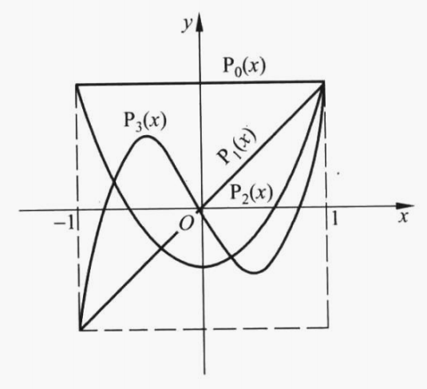

定义：若 $ f(x), g(x) \in C[a, b] $ ， $ \rho(x) $ 为 $ [a, b] $ 上的权函数且满足

$$
(f(x), g(x)) = \int_a^b \rho(x) f(x) g(x) dx = 0
$$

则称 $ f(x) $ 与 $ g(x) $ 在 $ [a, b] $ 上带权 $ \rho(x) $ **正交**。若函数族 $ \varphi_0(x), \varphi_1(x), ... , \varphi_n(x), ... $ 满足关系

$$
(\varphi_j(x), \varphi_k(x)) = \int_a^b \rho(x) \varphi_j(x) \varphi_k(x) dx = 
\begin{cases}
0, j \neq k \\
A_k > 0, j = k
\end{cases}
$$

则称 $ \lbrace \varphi_k(x) \rbrace $ 是 $ [a, b] $ 上带权 $ \rho(x) $ 的**正交函数族**。若 $ A_k \equiv 1 $ ，则称为**标准正交函数族**。

* * *

定理：三角函数族

$$
1, \cos x, \sin x, \cos 2x, \sin 2x, ...
$$

是区间 $ [-\pi, \pi] $ 上带权 $ \rho(x) \equiv 1 $ 的正交函数族。

证明：对 $ k = 1, 2, ... $

$$
(1, 1) = \int_{-\pi}^{\pi} 1 dx = 2 \pi
$$

$$
(\sin kx, \sin kx) = \int_{-\pi}^{\pi} \sin^2 kx dx = \frac {x - \frac {\sin 2kx} {2k}} {2} \bigg\vert_{-\pi}^{\pi} = \pi
$$

$$
(\cos kx, \cos kx) = \int_{-\pi}^{\pi} \cos^2 kx dx = \frac {x + \frac {\sin 2kx} {2k}} {2} \bigg\vert_{-\pi}^{\pi} = \pi
$$

$$
(1, \sin kx) = \int_{-\pi}^{\pi} \sin kx dx = -\frac {\cos kx} {k} \bigg\vert_{-\pi}^{\pi} = 0
$$

$$
(1, \cos kx) = \int_{-\pi}^{\pi} \cos kx dx = \frac {\sin kx} {k} \bigg\vert_{-\pi}^{\pi} = 0
$$

$$
(\sin kx, \cos kx) = \int_{-\pi}^{\pi} \sin kx \cos kx dx = \frac {1} {2} \int_{-\pi}^{\pi} \sin 2kx dx = 0
$$

再对 $ j = 1, 2, ... $ 且 $ j \neq k $

$$
(\sin kx, \sin jx) = \int_{-\pi}^{\pi} \sin kx \sin jx dx = \frac {1} {2} (\int_{-\pi}^{\pi} \cos (k-j)x dx - \int_{-\pi}^{\pi} \cos (k+j)x dx) = 0
$$

$$
(\cos kx, \cos jx) = \int_{-\pi}^{\pi} \cos kx \cos jx dx = \frac {1} {2} (\int_{-\pi}^{\pi} \cos (k+j)x dx + \int_{-\pi}^{\pi} \cos (k-j)x dx) = 0
$$

$$
(\sin kx, \cos jx) = \int_{-\pi}^{\pi} \sin kx \cos jx dx = \frac {1} {2} (\int_{-\pi}^{\pi} \sin (k+j)x dx + \int_{-\pi}^{\pi} \sin (k-j)x dx) = 0
$$

* * *

定义：设 $ \varphi_n(x) $ 是 $ [a, b] $ 上首项系数 $ a_n \neq 0 $ 的 $ n $ 次多项式， $ \rho(x) $ 为 $ [a, b] $ 上的权函数。如果多项式序列 $ \lbrace \varphi_n(x) \rbrace_0^{\infty} $ 是正交函数族，则称 $ \lbrace \varphi_n(x) \rbrace_0^{\infty} $ 为 $ [a, b] $ 上带权 $ \rho(x) $ 的**正交多项式**，称 $ \varphi_n(x) $ 为 $ n $ **次正交多项式**。

* * *

给定区间 $ [a, b] $ 及权函数 $ \rho(x) $ ，以及一族线性无关的幂函数 $ 1, x, x^2, ... $ ，利用施密特正交化可以构造出正交多项式 $ \lbrace \varphi_n(x) \rbrace_0^{\infty} $ 

$$
\varphi_0(x) = 1 \\
\varphi_n(x) = x^n - \sum_{j=0}^{n-1} \frac {(x^n, \varphi_j(x))} {(\varphi_j(x), \varphi_j(x))} \varphi_j(x), n = 1, 2, ...
$$

易知 $ \varphi_n(x) $ 最高项系数为 $ 1 $ 。

* * *

若 $ \lbrace \varphi_n(x) \rbrace_0^{\infty} $ 是正交多项式，易证对任意 $ n $ ， $ \varphi_0(x), \varphi_1(x), ... , \varphi_n(x) $ 在 $ [a, b] $ 上是线性无关的。从而有，任何 $ P(x) \in H_n $ 均可表示为 $ \varphi_0(x), \varphi_1(x), ... , \varphi_n(x) $ 的线性组合。此外， $ \varphi_n(x) $ 与任何 $ P(x) \in H_{n-1} $ 正交。

* * *

定理：设 $ \lbrace \varphi_n(x) \rbrace_0^{\infty} $ 是 $ [a, b] $ 上带权 $ \rho(x) $ 的正交多项式，对 $ n \geqslant 0 $ 成立递推关系

$$
\gamma \varphi_{n+1}(x) = (x - \beta) \varphi_n(x) - \alpha \varphi_{n-1}(x), n = 0, 1, ...
$$

其中

$$
\varphi_0(x) = 1 \\
\varphi_{-1}(x) = 0 \\
\alpha = \frac {(x \varphi_n(x), \varphi_{n-1}(x))} {(\varphi_{n-1}(x), \varphi_{n-1}(x))} \\
\beta = \frac {(x \varphi_n(x), \varphi_n(x))} {(\varphi_n(x), \varphi_n(x))} \\
\gamma = \frac {(x \varphi_n(x), \varphi_{n+1}(x))} {(\varphi_{n+1}(x), \varphi_{n+1}(x))}
$$

证明：由于 $ \varphi_0(x), \varphi_1(x), ... , \varphi_{n+1}(x) $ 构成 $ H_{n+1} $ 的一组基，而 $ x \varphi_n(x) \in H_{n+1} $ ，故 $ x \varphi_n(x) $ 可以表示为

$$
x \varphi_n(x) = a_0 \varphi_0(x) + a_1 \varphi_1(x) + ... + a_{n-2} \varphi_{n-2}(x) + \alpha \varphi_{n-1}(x) + \beta \varphi_n(x) + \gamma \varphi_{n+1}(x)
$$

两边用 $ \varphi_k(x), k = 0, 1, ... , n-2 $ 做内积，利用 $ \lbrace \varphi_n(x) \rbrace_0^{\infty} $ 的正交性可得

$$
(x \varphi_n(x), \varphi_k(x)) = a_k (\varphi_k(x), \varphi_k(x))
$$

又由正交多项式的性质可知

$$
(x \varphi_n(x), \varphi_k(x)) = (\varphi_n(x), x \varphi_k(x)) = 0
$$

因此

$$
a_k = 0, k = 0, 1, ... , n-2
$$

于是

$$
x \varphi_n(x) = \alpha \varphi_{n-1}(x) + \beta \varphi_n(x) + \gamma \varphi_{n+1}(x)
$$

两边分别用 $ \varphi_{n-1}(x), \varphi_n(x), \varphi_{n+1}(x) $ 做内积，可得

$$
\alpha = \frac {(x \varphi_n(x), \varphi_{n-1}(x))} {(\varphi_{n-1}(x), \varphi_{n-1}(x))} \\
\beta = \frac {(x \varphi_n(x), \varphi_n(x))} {(\varphi_n(x), \varphi_n(x))} \\
\gamma = \frac {(x \varphi_n(x), \varphi_{n+1}(x))} {(\varphi_{n+1}(x), \varphi_{n+1}(x))}
$$

并且

$$
\gamma \varphi_{n+1}(x) = (x - \beta) \varphi_n(x) - \alpha \varphi_{n-1}(x)
$$

得证。

特别地，若 $ \lbrace \varphi_n(x) \rbrace_0^{\infty} $ 的最高项次数为 $ 1 $ ，则有 $ x \varphi_{n-1}(x) - \varphi_n(x) \in H_{n-1} $ ，因此 $ (\varphi_n(x), x \varphi_{n-1}(x) - \varphi_n(x)) = 0 $ ，从而

$$
(x \varphi_n(x), \varphi_{n-1}(x)) = (\varphi_n(x), x \varphi_{n-1}(x)) = (\varphi_n(x), \varphi_n(x)) + (\varphi_n(x), x \varphi_{n-1}(x) - \varphi_n(x)) = (\varphi_n(x), \varphi_n(x))
$$

同理

$$
(\varphi_{n+1}(x), x \varphi_n(x)) = (\varphi_{n+1}(x), \varphi_{n+1}(x))
$$

故

$$
\alpha = \frac {(\varphi_n(x), \varphi_n(x))} {(\varphi_{n-1}(x), \varphi_{n-1}(x))} \\
\gamma = 1
$$

* * *

定理：设 $ \lbrace \varphi_n(x) \rbrace_0^{\infty} $ 是 $ [a, b] $ 上带权 $ \rho(x) $ 的正交多项式，则 $ \varphi_n(x) $ 在区间 $ (a, b) $ 内有 $ n $ 个不同的零点。

证明：假定 $ \varphi_n(x) $ 在区间 $ (a, b) $ 内的零点都是偶数重的，则 $ \varphi_n(x) $ 在区间 $ [a, b] $ 保持符号不变，这与

$$
(\varphi_n(x), \varphi_0(x)) = \int_a^b \rho(x) \varphi_n(x) \varphi_0(x) dx = 0
$$

矛盾，故 $ \varphi_n(x) $ 在区间 $ (a, b) $ 内存在奇数重的零点，不妨设为 $ a < x_1 < x_2 < ... < x_l < b $ 。令

$$
q(x) = (x - x_1) (x - x_2) ... (x - x_l)
$$

若 $ l < n $ ，则根据正交性有

$$
(q(x), \varphi_n(x)) = \int_a^b \rho(x) q(x) \varphi_n(x) dx = 0
$$

又根据 $ q(x) $ 的定义可知 $ q(x) \varphi_n(x) $ 在 $ (a, b) $ 内的零点全为偶数重的，故在区间 $ [a, b] $ 保持符号不变，与$ (q(x), \varphi_n(x)) = 0 $ 矛盾。

因此 $ l \geqslant n $ ，再由多项式为 $ n $ 次得证。

* * *

定义：当区间为 $ [-1, 1] $ ，权函数为 $ \rho(x) \equiv 1 $ 时，由 $ 1, x, ... , x^n, ... $ 正交化得到的多项式称为**勒让德多项式**，并用 $ P_0(x), P_1(x), ... , P_n(x), ... $ 表示。

* * *

1814年罗德利克给出了勒让德多项式的简单表达式

$$
P_0(x) = 1 \\
P_n(x) = \frac {1} {2^n n!} \frac {d^n} {dx^n} (x^2 - 1)^n, n = 1, 2, ...
$$

* * *

$ P_n(x) $ 中首项 $ x^n $ 的系数为 $ \frac {(2n)!} {2^n (n!)^2} $ ，显然最高项次数为 $ 1 $ 的勒让德多项式为

$$
\widetilde{P}_0(x) = 1 \\
\widetilde{P}_n(x) = \frac {n!} {(2n)!} \frac {d^n} {dx^n} (x^2 - 1)^n, n = 1, 2, ...
$$

* * *

勒让德多项式的正交性

$$
\int_{-1}^1 P_n(x) P_m(x) dx = \begin{cases}
0, m \neq n \\
\frac {2} {2n+1}, m = n
\end{cases}
$$

证明：令 $ \varphi(x) = (x^2 - 1)^n $ ，则

$$
\varphi^{(k)}(\pm 1) = 0, k = 0, 1, ... , n-1
$$

设 $ Q(x) $ 是在区间 $ [-1, 1] $ 上有 $ n $ 阶连续可微的函数，由分部积分法可知

$$
\begin{aligned}
\int_{-1}^1 P_n(x) Q(x) dx &= \frac {1} {2^n n!} \int_{-1}^1 \varphi^{(n)}(x) Q(x) dx \\
&= \frac {-1} {2^n n!} \int_{-1}^1 \varphi^{(n-1)}(x) Q^{(1)}(x) dx \\
&= ... \\
&= \frac {(-1)^n} {2^n n!} \int_{-1}^1 \varphi(x) Q^{(n)}(x) dx
\end{aligned}
$$

若 $ Q(x) $ 是次数小于 $ n $ 的多项式，则 $ Q^{(n)}(x) \equiv 0 $ ，故得

$$
\int_{-1}^1 P_n(x) P_m(x) dx = 0, m \neq n
$$

若

$$
Q(x) = P_n(x) = \frac {(2n)!} {2^n (n!)^2} x^n + ...
$$

则

$$
Q^{(n)}(x) = \frac {(2n)!} {2^n n!}
$$

于是

$$
\begin{aligned}
\int_{-1}^1 P_n^2(x) dx &= \frac {(-1)^n (2n)!} {2^{2n} (n!)^2} \int_{-1}^1 \varphi(x) dx \\
&= \frac {(2n)!} {2^{2n} (n!)^2} \int_{-1}^1 (1 - x^2)^n dx \\
&= \frac {2 (2n)!} {2^{2n} (n!)^2} \int_{0}^1 (1 - x^2)^n dx \\
&= \frac {2 (2n)!} {2^{2n} (n!)^2} \int_{0}^{\frac {\pi} {2}} \cos^{2n+1} t dt \\
&= \frac {2 (2n)!} {2^{2n} (n!)^2} \frac {2 * 4 * ... * (2n)} {1 * 3 * ... * (2n+1)} \\
&= \frac {2} {2n+1}
\end{aligned}
$$

得证。

* * *

勒让德多项式的奇偶性

$$
P_n(-x) = (-1)^n P_n(x)
$$

证明：由于 $ (x^2 - 1)^n $ 是偶函数，故经过偶数次求导仍为偶函数，经过奇数次求导为奇函数。得证。

* * *

勒让德多项式的递推关系

$$
(n+1) P_{n+1}(x) = (2n+1) x P_n(x) - n P_{n-1}(x), n = 1, 2, ...
$$

证明：考虑正交多项式所满足的递推公式

$$
x P_n(x) = \alpha P_{n-1}(x) + \beta P_n(x) + \gamma P_{n+1}(x)
$$

等式左边最高次项的系数为 $ \frac {(2n)!} {2^n (n!)^2} $ ，等式右边最高次项的系数为 $ \frac {\gamma (2n+2)!} {2^{n+1} ((n+1)!)^2} $ ，二者应该相等，从而有

$$
\gamma = \frac {(x P_n(x), P_{n+1}(x))} {(P_{n+1}(x), P_{n+1}(x))} = \frac {n+1} {2n+1}
$$

故

$$
(x P_n(x), P_{n+1}(x)) = \frac {n+1} {2n+1} (P_{n+1}(x), P_{n+1}(x)) = \frac {2n+2} {(2n+1) (2n+3)}
$$

同理有

$$
(x P_n(x), P_{n-1}(x)) = (x P_{n-1}(x), P_n(x)) = \frac {2n} {(2n-1) (2n+1)}
$$

故

$$
\alpha = \frac {(x P_n(x), P_{n-1}(x))} {(P_{n-1}(x), P_{n-1}(x))} = \frac {n} {2n+1}
$$

又

$$
\alpha = \frac {(x P_n(x), P_{n-1}(x))} {(P_{n-1}(x), P_{n-1}(x))} = \frac {n} {2n+1}
$$

又 $ x P_n^2(x) $ 为奇函数，故 $ (x P_n(x), P_n(x)) = \int_{-1}^1 x P_n^2(x) dx = 0 $ ，因此

$$
\beta = \frac {(x P_n(x), P_n(x))} {(P_n(x), P_n(x))} = 0
$$

将 $ \alpha, \beta, \gamma $ 代入递推公式，得证。

* * *

利用勒让德多项式的递推公式有

$$
\begin{aligned}
&P_0(x) = 1 \\
&P_1(x) = x \\
&P_2(x) = \frac {3 x^2 - 1} {2} \\
&P_3(x) = \frac {5 x^3 - 3 x} {2} \\
&P_4(x) = \frac {35 x^4 - 30 x^2 + 3} {8} \\
&P_5(x) = \frac {63 x^5 - 70 x^3 + 15x} {8} \\
&P_6(x) = \frac {231 x^6 - 315 x^4 + 105 x^2 - 5} {16} \\
&...
\end{aligned}
$$

* * *

$ P_n(x) $ 在区间 $ (-1, 1) $ 内有 $ n $ 个不同的实零点。

* * *

$ P_{2k}(x) $ 只含 $ x $ 的偶次幂，$ P_{2k+1}(x) $ 只含 $ x $ 的奇次幂。

* * *

定义：当区间为 $ [-1, 1] $ ，权函数为 $ \rho(x) \equiv \frac {1} {\sqrt{1 - x^2}} $ 时，由 $ 1, x, ... , x^n, ... $ 正交化得到的多项式称为**切比雪夫多项式**，它可表示为

$$
T_n(x) = \cos (n \arccos x), \vert x \vert \leqslant 1
$$

若令 $ x = \cos \theta $ ，则 $ T_n(x) = \cos n \theta, 0 \leqslant \theta \leqslant \pi $ 。

* * *

切比雪夫多项式的递推关系

$$
T_0(x) = 1 \\
T_1(x) = x \\
T_{n+1}(x) = 2x T_n(x) - T_{n-1}(x), n = 2, 3, ...
$$

证明：由三角恒等式

$$
\cos (n+1) \theta = 2 \cos \theta \cos n \theta - \cos (n-1) \theta, n = 1, 2, ...
$$

得证。

* * *

利用切比雪夫多项式的递推关系有

$$
\begin{aligned}
&T_0(x) = 1 \\
&T_1(x) = x \\
&T_2(x) = 2x^2 - 1 \\
&T_3(x) = 4x^3 - 3x \\
&T_4(x) = 8x^4 - 8x^2 + 1 \\
&T_5(x) = 16x^5 - 20x^3 + 5x \\
&T_6(x) = 32x^6 - 48x^4 + 18x^2 - 1 \\
&...
\end{aligned}
$$

[...img]

* * *

切比雪夫多项式的正交性

$$
\int_{-1}^1 \frac {T_n(x) T_m(x)} {\sqrt{1 - x^2}} dx = \begin{cases}
0, m \neq n \\
\frac {\pi} {2}, m = n \neq 0 \\
\pi, m = n = 0
\end{cases}
$$

证明：令 $ x = \cos \theta $ ，则 $ dx = -\sin \theta d \theta $ ，从而

$$
\int_{-1}^1 \frac {T_n(x) T_m(x)} {\sqrt{1 - x^2}} dx = \int_{0}^{\pi} \cos n \theta \cos m \theta d \theta = \begin{cases}
0, m \neq n \\
\frac {\pi} {2}, m = n \neq 0 \\
\pi, m = n = 0
\end{cases}
$$

* * *

$ T_n(x) $ 在区间 $ (-1, 1) $ 内有 $ n $ 个不同的实零点

$$
x_k = \cos \frac {2k-1} {2n} \pi, k = 1, 2, ... , n
$$

$ T_n(x) $ 在区间 $ [-1, 1] $ 内有 $ n+1 $ 个极值点

$$
x_k^* = \cos \frac {k \pi} {n} \pi, k = 0, 1, ... , n
$$

轮流取最大值 $ 1 $ 和最小值 $ -1 $ 。

这两组点称为**切比雪夫点**。切比雪夫点恰好是单位圆周上等距分布点的横坐标，这些点的横坐标在接近区间 $ [-1, 1] $ 的端点处是密集的。

[...img]

* * *

$ T_{2k}(x) $ 只含 $ x $ 的偶次幂，$ T_{2k+1}(x) $ 只含 $ x $ 的奇次幂。

* * *

$ T_{2k}(x) $ 为偶函数，$ T_{2k+1}(x) $ 为奇函数。

* * *

$ T_n(x) $ 的最高次项系数是 $ 2^{n-1} $ 。若令 $ \widetilde{T}_0(x) = 1, \widetilde{T}_n(x) = \frac {T_n(x)} {2^{n-1}}, n = 1, 2, ... $ ，则 $ \widetilde{T}_n(x) $ 是首项系数为 $ 1 $ 的切比雪夫多项式。

* * *

定理：设 $ n \geqslant 1 $ ， $ \widetilde{T}_n(x) $ 是首项系数为 $ 1 $ 的切比雪夫多项式， $ \widetilde{H}_n(x) $ 是首项系数为 $ 1 $ 的次数不超过 $ n $ 的多项式的集合，则

$$
\underset {-1 \leqslant x \leqslant 1} {\max} \vert \widetilde{T}_n(x) \vert = \frac {1} {2^{n-1}} \leqslant \underset {-1 \leqslant x \leqslant 1} {\max} \vert P(x) \vert, \forall P(x) \in \widetilde{H}_n(x)
$$

证明：数学归纳法。

当 $ n = 1 $ 时， $ \widetilde{H}_n(x) = \lbrace P(x) = x + c \vert c \in \mathbb{R} \rbrace \cup \lbrace P(x) = 1 \rbrace $ ，从而

$$
\underset {-1 \leqslant x \leqslant 1} {\max} \vert P(x) \vert = 1 = \underset {-1 \leqslant x \leqslant 1} {\max} \vert \widetilde{T}_n(x) \vert
$$

结论成立。

假设结论对 $ n < m $ 的情况成立，对 $ n = m $ 的情况做如下两种讨论：

若 $ P(x) \in \widetilde{H}_n(x) $ 的次数小于 $ n $ ，则有 $ P(x) \in \widetilde{H}_{n-1}(x) $ ，从而

$$
\underset {-1 \leqslant x \leqslant 1} {\max} \vert \widetilde{T}_n(x) \vert = \frac {1} {2^{n-1}} < \frac {1} {2^{n-2}} = \underset {-1 \leqslant x \leqslant 1} {\max} \vert \widetilde{T}_{n-1}(x) \vert \leqslant \underset {-1 \leqslant x \leqslant 1} {\max} \vert P(x) \vert
$$

结论成立。

若 $ P(x) \in \widetilde{H}_n(x) $ 次数为 $ n $ ，用反证法。假设对 $ P(x) $ 有

$$
\underset {-1 \leqslant x \leqslant 1} {\max} \vert P(x) \vert < \underset {-1 \leqslant x \leqslant 1} {\max} \vert \widetilde{T}_n(x) \vert = \frac {1} {2^{n-1}}
$$

由 $ \widetilde{T}_n(x) $ 在 $ x_k^* = \cos \frac {k \pi} {n} \pi, k = 0, 1, ... , n $ 轮流取最大值 $ \frac {1} {2^{n-1}} $ 和最小值 $ -\frac {1} {2^{n-1}} $ 我们有

$$
P( x_k^* ) - \widetilde{T}_n( x_k^* ) < 0, k = 2m, m \in \mathbb{Z} \\
P( x_k^* ) - \widetilde{T}_n( x_k^* ) > 0, k = 2m+1, m \in \mathbb{Z}
$$

根据零点存在性定理有 $ P(x) - \widetilde{T}_n(x) $ 在 $ (-1, 1) $ 上至少有 $ n $ 个零点。

又 $ P(x), \widetilde{T}_n(x) $ 均是首一 $ n $ 次多项式，故 $ P(x) - \widetilde{T}_n(x) $ 次数不超过 $ n-1 $ ，由多项式恒等定理， $ P(x) \equiv \widetilde{T}_n(x) $ ，矛盾，从而结论成立。

综上得证。

* * *

例：求 $ f(x) = 2x^3 + x^2 + 2x - 1 $ 在 $ [-1, 1] $ 上的最佳二次逼近多项式。

解：由题意，所求最佳逼近多项式 $ P_2^* (x) $ 应满足 $ \underset {-1 \leqslant x \leqslant 1} {\max} \vert f(x) - P_2^* (x) \vert $ 最小，而 $ f(x) - P_2^* (x) $ 是三次多项式且首项系数为 $ 2 $ ，故可记 $ f(x) - P_2^* (x) = 2 g(x) $ ， $ g(x) $ 是三次首一多项式。要使 $ \underset {-1 \leqslant x \leqslant 1} {\max} \vert f(x) - P_2^* (x) \vert $ 即 $ \underset {-1 \leqslant x \leqslant 1} {\max} \vert 2 g(x) \vert $ 最小，则 $ g(x) $ 需为三次首一切比雪夫多项式，从而

$$
P_2^* (x) = f(x) - 2 \widetilde{T}_3(x) = f(x) - \frac {T_3(x)} {2} = x^2 + \frac {7} {2} x - 1
$$

* * *

切比雪夫多项式的其他表示形式

$$
T_n(x) = \sum_{k=0}^{\lfloor \frac {n} {2} \rfloor} \binom {n} {2k} x^{n-2k} (x^2 - 1)^k = \sum_{l=0}^{\lfloor \frac {n} {2} \rfloor} \bigg[ (-1)^l \sum_{k=l}^{\lfloor \frac {n} {2} \rfloor} \binom {n} {2k} \binom {k} {l} \bigg] x^{n-2l}
$$

证明：根据欧拉公式有

$$
\begin{aligned}
T_n(x) &= \cos n \theta \\
&= Re(e^{i n \theta}) \\
&= Re((\cos \theta + i \sin \theta)^n) \\
&= Re(\sum_{r=0}^n \binom {n} {r} \cos^{n-r} \theta (i \sin \theta)^r) \\
&= \sum_{k=0}^{\lfloor \frac {n} {2} \rfloor} \binom {n} {2k} \cos^{n-2k} \theta (-1)^k \sin^{2k} \theta \\
&= \sum_{k=0}^{\lfloor \frac {n} {2} \rfloor} \binom {n} {2k} x^{n-2k} (x^2 - 1)^k
\end{aligned}
$$

再对 $ (x^2 - 1)^k $ 坐二项式展开

$$
\begin{aligned}
\sum_{k=0}^{\lfloor \frac {n} {2} \rfloor} \binom {n} {2k} x^{n-2k} (x^2 - 1)^k &= \sum_{k=0}^{\lfloor \frac {n} {2} \rfloor} \binom {n} {2k} x^{n-2k} \sum_{l=0}^k \binom {k} {l} (-1)^l x^{2k-2l} \\
&= \sum_{k=0}^{\lfloor \frac {n} {2} \rfloor} \sum_{l=0}^k \binom {n} {2k} \binom {k} {l} (-1)^l x^{n-2l} \\
&= \sum_{l=0}^{\lfloor \frac {n} {2} \rfloor} \bigg[ (-1)^l \sum_{k=l}^{\lfloor \frac {n} {2} \rfloor} \binom {n} {2k} \binom {k} {l} \bigg] x^{n-2l}
\end{aligned}
$$

* * *

切比雪夫多项式的另一种递推公式

$$
T_n(\frac {y + y^{-1}} {2}) = \frac {y^n + y^{-n}} {2}, y \in \mathbb{C}, y \neq 0
$$

证明：令 $ y = e^{i \theta} $ 易得。

* * *

定理：设插值节点 $ x_0, x_1, ... , x_n $ 为切比雪夫多项式 $ T_{n+1}(x) $ 的零点，被插函数 $ f \in C[-1, 1] $ ， $ L_n(x) $ 为相应的 $ n $ 次拉格朗日插值多项式，则

$$
\underset {-1 \leqslant x \leqslant 1} {\max} \vert f(x) - L_n(x) \vert \leqslant \frac {\Vert f^{(n+1)}(x) \Vert_{\infty}} {2^n (n+1)!}
$$

证明：由插值余项

$$
R(x) = f(x) - L_n(x) = \frac {f^{(n+1)}(\xi)} {(n+1)!} \omega_{n+1}(x)
$$

可得

$$
\underset {-1 \leqslant x \leqslant 1} {\max} \vert f(x) - L_n(x) \vert \leqslant \frac {\Vert f^{(n+1)}(x) \Vert_{\infty}} {(n+1)!} \underset {-1 \leqslant x \leqslant 1} {\max} \vert \omega_{n+1}(x) \vert
$$

由插值节点为 $ T_{n+1}(x) $ 的零点可得

$$
\underset {-1 \leqslant x \leqslant 1} {\max} \vert \omega_{n+1}(x) \vert = \underset {-1 \leqslant x \leqslant 1} {\max} \vert \widetilde{T}_{n+1}(x) \vert = \frac {1} {2^n}
$$

得证。

* * *

$ \Vert f^{(n+1)}(x) \Vert_{\infty} $ 是由被插值函数确定的，而利用切比雪夫多项式零点进行插值，可使 $ \underset {-1 \leqslant x \leqslant 1} {\max} \vert \omega_{n+1}(x) \vert $ 最小化，从而使插值区间最大误差最小化，在高次插值的情况下可以避免龙格现象。

对于一般区间 $ [a, b] $ 上的插值只要利用变换 $ x = \frac {(b-a)t+a+b} {2} $ 则可得相应结果，此时插值节点是

$$
x_k = \frac {b-a} {2} \cos \frac {2k+1} {2n+2} \pi + \frac {a+b} {2}, k = 0, 1, ... , n
$$

[...img]

* * *

定义：在区间 $ [-1, 1] $ 上带权 $ \rho(x) = \sqrt{1 - x^2} $ 的正交多项式称为**第二类切比雪夫多项式**，其表达式为

$$
U_n(x) = \frac {\sin [(n+1) \arccos x]} {\sqrt{1 - x^2}}
$$

* * *

第二类切比雪夫多项式的正交性

$$
\int_{-1}^1 U_n(x) U_m(x) \sqrt{1 - x^2} dx = \begin{cases}
0, m \neq n \\
\frac {\pi} {2}, m = n
\end{cases}
$$

证明：令 $ x = \cos \theta $ 易得。

* * *

第二类切比雪夫多项式的递推公式

$$
U_0(x) = 1 \\
U_1(x) = 2x \\
U_{n+1}(x) = 2x U_n(x) - U_{n-1}(x), n = 1, 2, ...
$$

证明：考虑三角恒等式 $ \sin (n+2) \theta = 2 \cos \theta \sin (n+1) \theta - \sin n \theta $ 易得。

* * *

定义：在区间 $ [0, +\infty) $ 上带权 $ \rho(x) = e^{-x} $ 的正交多项式称为**拉盖尔多项式**，其表达式为

$$
L_n(x) = e^x \frac {d^n} {dx^n} (x^n e^{-x})
$$

* * *

拉盖尔多项式的递推公式

$$
L_0(x) = 1 \\
L_1(x) = 1 - x \\
L_{n+1}(x) = (1+2n-x) L_n(x) - n^2 L_{n-1}(x), n = 1, 2, ...
$$

证明：令 $ \varphi(x) = x^{n-1} e^{-x} $ ，则 $ \varphi'(x) = (n-1) x^{n-2} e^{-x} - x^{n-1} e^{-x} $ ，两边乘以 $ x $ 并整理有

$$
x \varphi'(x) = (n-1-x) \varphi(x)
$$

两边再对 $ x $ 求 $ n $ 阶导数并整理可得

$$
x \varphi^{(n+1)}(x) + (x+1) \varphi^{(n)}(x) + n \varphi^{(n-1)}(x) = 0
$$

又

$$
(x \varphi(x))^{(n)} = x \varphi^{(n)}(x) + n \varphi^{(n-1)}(x) \\
(x^2 \varphi(x))^{(n+1)} = x^2 \varphi^{(n+1)}(x) + (2n+2)x \varphi^{(n)}(x) + (n+1)n \varphi^{(n-1)}(x)
$$

故

$$
\begin{aligned}
L_{n+1}(x) - (1+2n-x) L_n(x) &= e^x \bigg( (x^2 \varphi(x))^{(n+1)} - (1+2n-x) (x \varphi(x))^{(n)} \bigg) \\
&= e^x \bigg( x^2 \varphi^{(n+1)}(x) + (x+1)x \varphi^{(n)}(x) - n(n-x) \varphi^{(n-1)}(x) \bigg) \\
&= -e^x \bigg( nx \varphi^{(n-1)}(x) + n(n-x) \varphi^{(n-1)}(x) \bigg) \\
&= -n^2 L_{n-1}(x)
\end{aligned}
$$

得证。

* * *

拉盖尔多项式的正交性

$$
\int_{0}^{\infty} L_n(x) L_m(x) e^{-x} dx = \begin{cases}
0, m \neq n \\
(n!)^2, m = n
\end{cases}
$$

证明：令 $ \varphi(x) = x^n e^{-x} $ ，利用证明勒让德多项式正交性的思路，结论成立。

* * *

定义：在区间 $ [-\infty, +\infty) $ 上带权 $ \rho(x) = e^{-x^2} $ 的正交多项式称为**埃尔米特多项式**，其表达式为

$$
H_n(x) = (-1)^n e^{x^2} \frac {d^n} {dx^n} (e^{-x^2})
$$

* * *

埃尔米特多项式的递推公式

$$
H_0(x) = 1 \\
H_1(x) = 2x \\
H_{n+1}(x) = 2x H_n(x) - 2n H_{n-1}(x), n = 1, 2, ...
$$

证明：令 $ \varphi(x) = e^{-x^2} $ ，则有

$$
\varphi'(x) + 2x \varphi(x) = 0
$$

两边再对 $ x $ 求 $ n $ 阶导数并整理可得

$$
\varphi^{(n+1)}(x) + 2x \varphi^{(n)}(x) + 2n \varphi^{(n-1)}(x) = 0
$$

易得结论成立。

* * *

埃尔米特多项式的正交性

$$
\int_{-\infty}^{\infty} H_n(x) H_m(x) e^{-x^2} dx = \begin{cases}
0, m \neq n \\
2^n n! \sqrt{\pi}, m = n
\end{cases}
$$

证明：令 $ \varphi(x) = e^{-x^2} $ ，利用证明勒让德多项式正交性的思路，结论成立。

* * *

[上一级](./../index.html)
